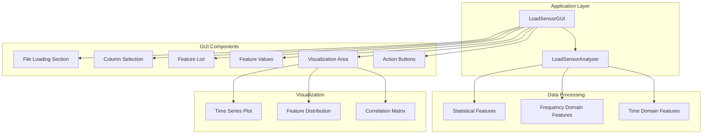
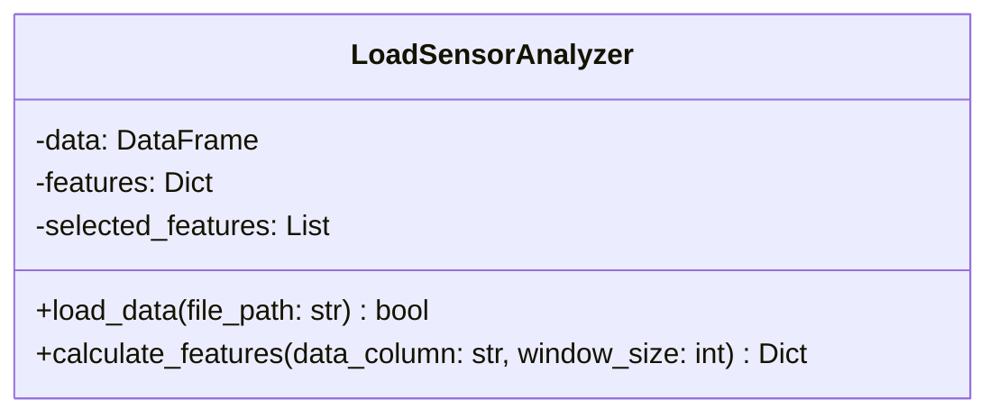
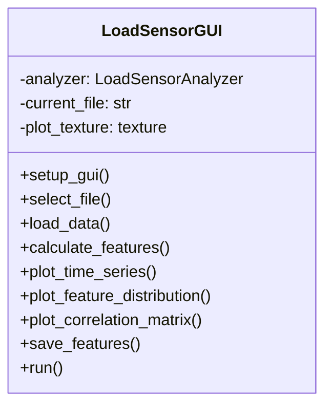
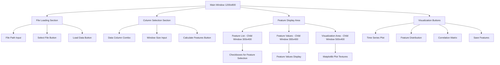
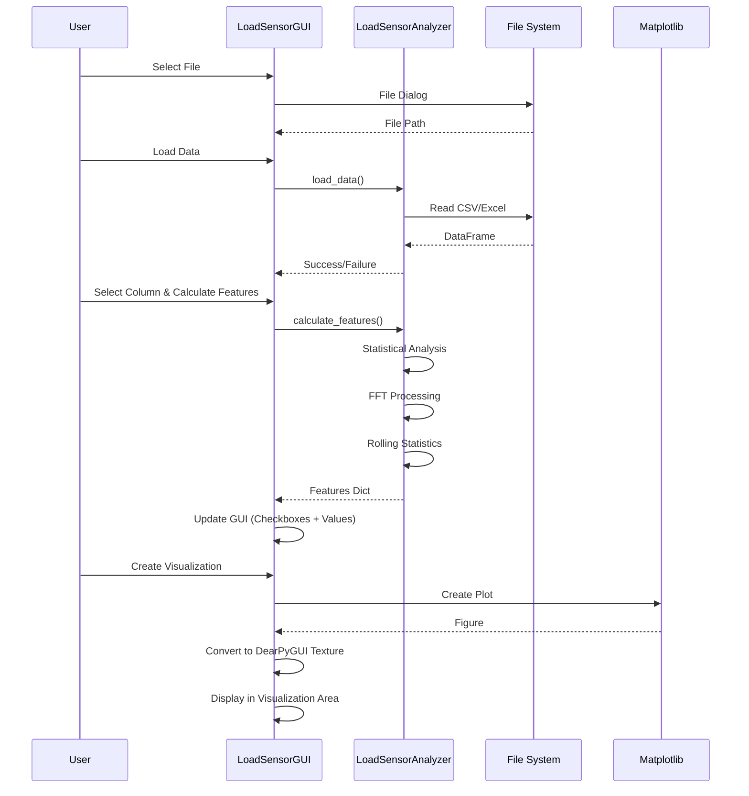
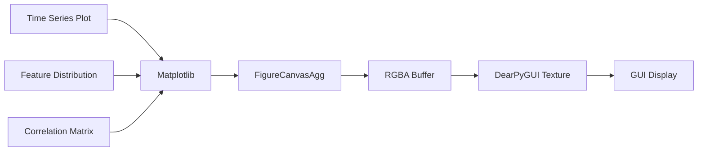

# Load Sensor GUI アプリケーション構成

## 概要

時系列ロードセンサーデータの分析と機械学習特徴量抽出を行うDearPyGUIベースのGUIアプリケーションです。

## アーキテクチャ

## クラス構成

### LoadSensorAnalyzer

**主要機能:**
- CSV/Excel ファイル読み込み
- **20+の特徴量抽出アルゴリズム**
  - 統計特徴量: mean, std, max, min, range, rms, skewness, kurtosis等
  - 周波数ドメイン特徴量: FFTベース解析
  - 時間ドメイン特徴量: rolling統計、変化点検出

### LoadSensorGUI

## GUI レイアウト構成

## データフロー

## 特徴量カテゴリ

### 統計特徴量 (10種類)
- mean, std, max, min, range
- rms, peak_to_peak, crest_factor
- skewness, kurtosis

### 周波数ドメイン特徴量 (2種類)
- spectral_centroid
- spectral_energy

### 時間ドメイン特徴量 (8種類)
- Rolling統計: mean_of_rolling_mean, std_of_rolling_mean, mean_of_rolling_std, std_of_rolling_std
- 変化点検出: mean_diff, std_diff, max_diff
- ゼロクロッシング: zero_crossing_rate

## 可視化機能

**対応プロット:**
- 時系列プロット
- 特徴量分布（最大4つの特徴量）
- 特徴量相関行列